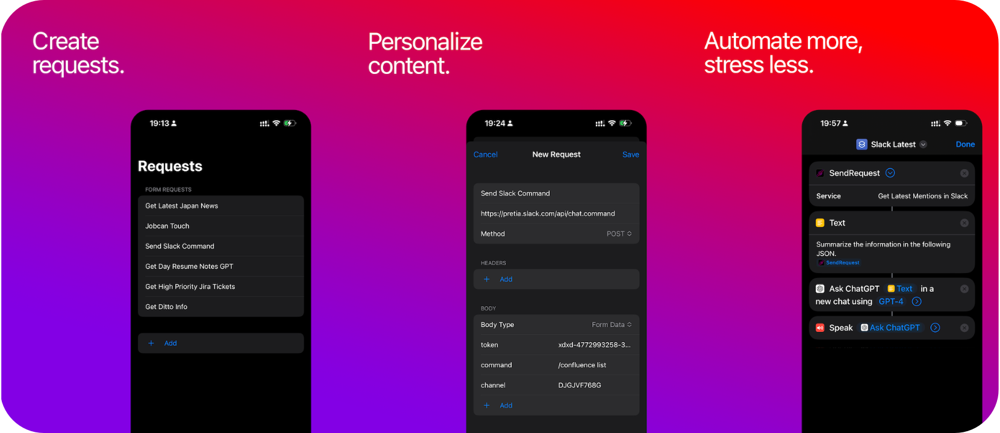

<p align="center">
  
</p>

[](https://javier-games.itch.io/bypass-api)

# Bypass API

Open source project for iOS that allows users to effortlessly send requests and receive responses with integration with Apple's Shortcuts app.

## Features

- **Send requests**: Send requests and receive responses from the app.
- **Body content flexibility**: Supports two types (JSON and Multi-Form).
- **Customizable headers and method types**: Modify your requests to your specific needs.
- **Action for Shortcuts app**: Zero input send request available as action in Shortcuts app.



## Usage

Bypass API is user-friendly and easy to navigate. Here's how you can make the most out of it:

1. Open the app and press the 'Add' button on the main menu to create a new request.
2. Assign a name to your request. This name will serve as its unique identifier.
3. Insert a valid URL from an API. If no URL is input, the request won't be created. For initial trials, you can use a public API such as the listed in the [Public APIs Project](https://github.com/public-apis/public-apis).
4. Specify additional details for your request, such as the HTTP method, headers, and body type. Please note that only JSON and Multi Form types are currently supported.
5. Send the request, the response will appear in a scrollable prompt message.

Integration with Shortcuts app.

1. Open the Apple Shortcuts app and create a new shortcut.
2. From the 'Actions' menu, choose the actions related to Bypass API and select 'SendRequest'.
3. Input the name of the request you wish to run.
4. Press 'Run'. A text response will be displayed containing the results of your request.

[](https://itch.io/embed-upload/11860138)

## Requirements

- Xcode 14.2+
- iOS 16.5+

Note: An account enrolled to the Apple Developer program is required to use the Shortcuts App integration to exchange information between the Bypass API app and the Shortcuts app.

## Installation

1. Clone the repository:

```bash
git clone https://github.com/javier-games/app-bypass-api.git
```

2. Open the project in Xcode:

```bash
open "Bypass API.xcodeproj"
```

3. Assign a new bundle ID and profile if you're not a member of the current team.
4. Make sure you have App Groups enabled.
5. Analyze and build the project.

## License

Bypass API is available under the MIT license. See the [LICENSE](LICENSE) file for more info.

## Contribution

Please read our [Contributing Guide](CONTRIBUTING.md) before submitting a Pull Request to the project.

## Support

For any questions or issues regarding the App usage please visit our [support](SUPPORT.md) page.